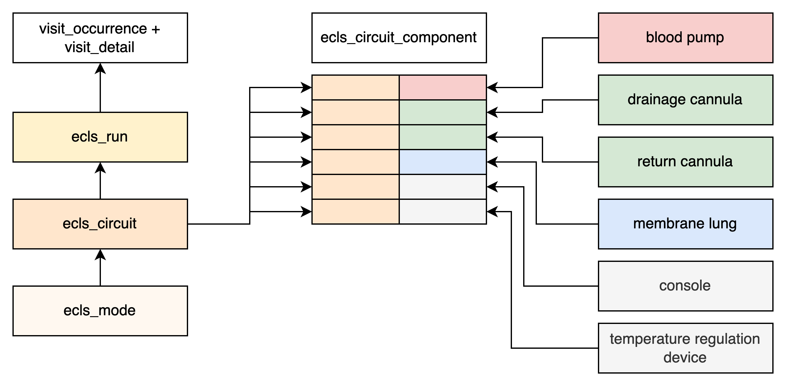
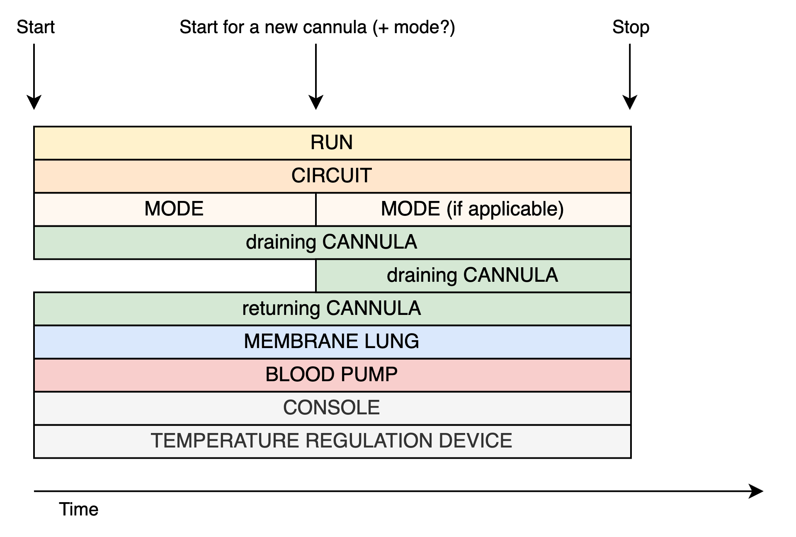
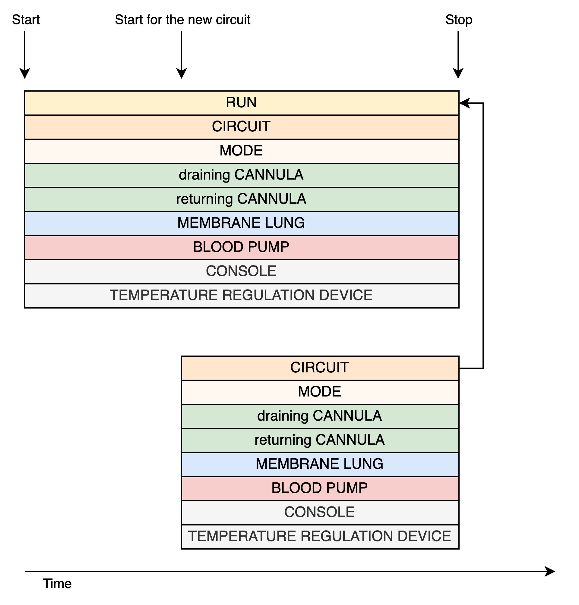
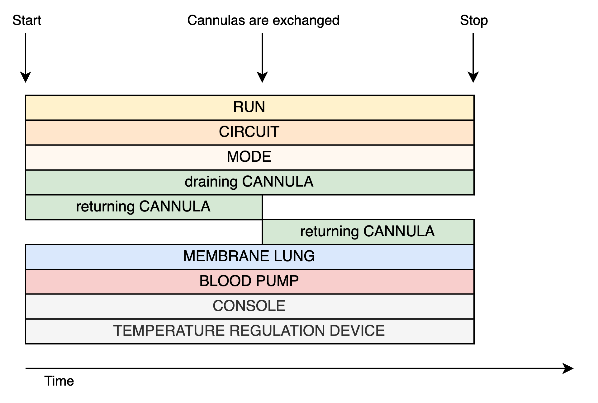
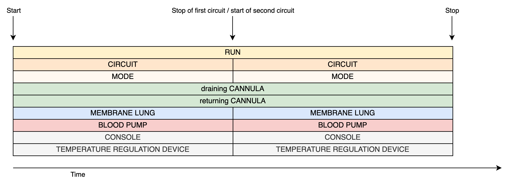

# Use cases

With novel cannulation strategies on the rise, the majority of ECLS
treatment still involves venovenous or venoarterial extracorporeal
membrane oxygenation procedures. To help new users understand the basic
mapping procedures when using the ECLS CDM we want to provide mapping
some typical use cases.

## Mapping a standard run without user intervention

Assume the machine runs smoothly with no need to change any circuit parts:
Your ECLS circuit will most-likely consist of the following components:

  - A console
  - Two single-lumen cannulas, one draining blood, one returning; alternatively
    one dual-lumen cannula, providing both blood flow directions
  - A blood pump
  - A membrane lung
  - A temperature regulation device

For each of the components as well as the run and circuit you will have
to create a database entry.

**Overview of the connected database entries:**

<figure markdown="span">
  {:style="height:300px;"}
  <figcaption>Components need to be connected to the circuit
  using the ecls_circuit_component table. The colored boxes represent
  one database entry in the respective database table.</figcaption>
</figure>

*.start_datetime* and *.stop_datetime* are the same for each entry, since
the components were started at the same time and stopped at the same time
as well.

## Adding more cannulas

If more cannulas are required, it's as simple as adding
a new entry in *ecls_cannula* and connecting it via the *ecls_circuit_component*
table. The *start_datetime* is inherently difference for the latter entry.

More cannulas might be necessary due to drainage insufficiencies or changes
in strategies (e.g.: switching from VV-ECMO to VVA-ECMO).

!!! note
    If the cannula changes the mode, make sure to set a proper *.stop_datetime*
    for the current entry in *ecls_mode* and add a new entry where:

    *old_entry*.stop_datetime == *new_entry*.start_datetime

!!! note
    Adding a third venous cannula to a veno-venous configuration will not
    change the mode.

<figure markdown="span">
{:style="height:300px;"}
<figcaption>Each colored bar represents a database entry. The third cannula
will have a different <b>start_datetime</b> because it was inserted lateron.
</figcaption>
</figure>

## Adding more circuits

Following a similar pattern, adding a second circuit is just as easy as
adding more components.

<figure markdown="span">
{:style="height:450px;"}
<figcaption>Make sure that the second circuit is connected to the same entry in <b>ecls_run</b>.</figcaption>
</figure>

## Multiple membrane lungs

Sometimes more than one membrane lung necessary to increase oxygenation
and decarboxylation efficiencies. After adding a second membrane lung to
your database and connecting it to the circuit, you will need an additional
entry in the *observation* table specifying the configuration of the
membrane lungs in relation to each other.

<figure markdown="span">
{:style="height:300px;"}
<figcaption>Another membrane lung is introduced.</figcaption>
</figure>

!!! info "Concepts for the *observation* table"
    Choose accordingly:

    *[36717872](https://athena.ohdsi.org/search-terms/terms/36717872/){:target="_blank"},	Membrane lungs in serial configuration*  
    *[36717873](https://athena.ohdsi.org/search-terms/terms/36717873/){:target="_blank"},	Membrane lungs in parallel configuration*

## Exchanging a cannula

If one of your cannulas needs to be removed and replaced with a new cannula,
stop the old cannula, select an appropriate *removal_concept_id*, and add a new cannula. M

!!! info "Complication"
    If the reason for the removal of the cannula
    is a complication, you must declare the appropriate complication in
    *stop_reason_concept_id* of the cannula.

<figure markdown="span">
{:style="height:300px;"}
<figcaption>Make sure to adjust the timestamps correctly, when changing cannulas.</figcaption>
</figure>

## Changing the circuit

This procedure may be more common. If the circuit begins to deteriorate (chronic hemolysis, clotting, etc.), physicians might indicate a circuit change. Typically, the cannulas remain in place while the rest of the components are replaced.

<figure markdown="span">

<figcaption><b>Cannulas</b> and the <b>run</b> stay the same. Connect all new components to the corresponding circuit and both circuits to the same run.</figcaption>
</figure>
